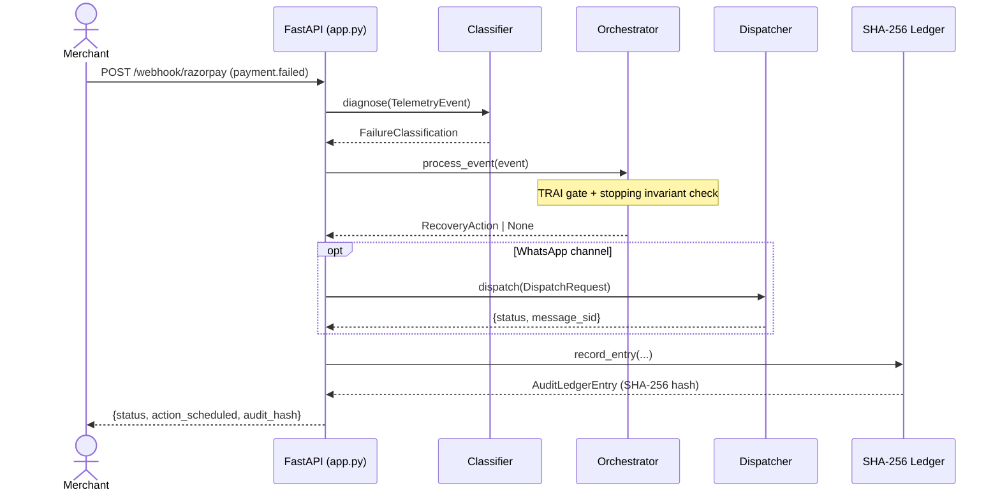

# RevPulse Sentinel — Technical Guide

This document describes the current executable prototype. When it conflicts with code or assertion-based tests, the code and tests win.

## Core Safety Rule

> **AI/ML models classify and explain; deterministic policy rules, TRAI chrono-gates, stopping invariants, and mathematical MDP validate and execute.**

- Error code classification is an evidence-bound diagnostic, never an autonomous recovery verdict.
- Missing or ambiguous error signatures default to `TERMINAL_AUTH_REJECTED` (halt), not an inferred optimistic action.
- Recovery sequences are reproducible from stored facts: entity_id, classification, attempt_count, gross_amount_paise, bank CBS state, scheduled_timestamp_epoch.
- Every payment state transition is an audited, immutable SHA-256-hashed ledger block.

## Runtime Architecture

| Layer | Technology | Responsibility |
| --- | --- | --- |
| Web UI | Streamlit, Plus Jakarta Sans, JetBrains Mono | 5-tab command center: KPIs, CBS inspector, MDP simulator, WhatsApp sandbox, ledger explorer |
| API | FastAPI, Pydantic v2 | Validates requests, exposes webhook handler, benchmark runner, health/readiness |
| Telemetry Classifier | Pure Python, CBS registry dict | Parses raw error codes against issuing bank CBS health matrix; classifies transient vs. terminal |
| Recovery Orchestrator | Deterministic Python, MDP formulation | Enforces TRAI chrono-gate (08:00–19:00 IST), stopping invariants (≤3 touches), dynamic interval scheduling |
| Dispatcher | Twilio SDK / mock mode | Hinglish WhatsApp message generation; Razorpay Payment Link + Virtual Account API calls |
| SHA-256 Audit Ledger | `hashlib`, append-only chain | Cryptographic state-transition blocks; paisa-exact settlement verification |
| Benchmark Dataset | `data/synthetic_batch_50.json` | 50-record multi-vector synthetic evaluation fixture |

## Request Flow



## 4-Layer Engine

### Layer 1 — Telemetry Diagnostic & CBS Health Classifier (`src/classifier.py`)

Parses raw error signatures against a live issuing bank CBS health matrix:

| Bank | Status | Avg Recovery |
| --- | --- | --- |
| HDFC | DEGRADED | +45m |
| UTIB (Axis) | DEGRADED | +30m |
| KKBK (Kotak) | DEGRADED | +60m |
| SBIN | HEALTHY | — |
| ICIC | HEALTHY | — |

Error signal → classification decision tree:

```
event_type == "invoice.overdue"         → B2B_OVERDUE_INVOICE
event_type == "checkout.dropped"        → ABANDONED_CHECKOUT
"TIMEOUT" | "GATEWAY_ERROR" | DEGRADED  → TRANSIENT_NETWORK_DOWN
"INSUFFICIENT_FUNDS" | "BALANCE_LOW"    → TRANSIENT_BALANCE_LOW
"CARD_EXPIRED" | "MANDATE_REVOKED"      → TERMINAL_ACCOUNT_CLOSED  ← HALT
default                                 → TERMINAL_AUTH_REJECTED    ← HALT
```

### Layer 2 — Policy-Gated Recovery Orchestrator (`src/orchestrator.py`)

Enforces three hard invariants before scheduling any action:

1. **Attempt cap**: `attempt_count >= 3` → return `None` immediately.
2. **Terminal halt**: `TERMINAL_*` classification → return `None` immediately.
3. **TRAI chrono-gate**: scheduled time outside 08:00–19:00 IST → defer `+12h` (WhatsApp only; silent retries exempt).

Then selects the recovery channel and interval:

| Classification | Delay | Channel |
| --- | --- | --- |
| TRANSIENT_NETWORK_DOWN | +45m (CBS window) | SILENT_API_RETRY |
| TRANSIENT_BALANCE_LOW | +24h | WHATSAPP_HINGLISH |
| B2B_OVERDUE_INVOICE | +1h | WHATSAPP_HINGLISH + Virtual Account |
| ABANDONED_CHECKOUT | +15m | WHATSAPP_HINGLISH + Payment Link |

### Layer 3 — Adaptive Multi-Channel Dispatcher (`src/dispatcher.py`)

- **Track A — Silent Retry**: `POST /v1/subscriptions/{id}/retry` via Razorpay SDK. Transparent to customer.
- **Track B — Hinglish WhatsApp**: Empathetic code-switched message with signed 1-click Razorpay Payment Link (`plink_…`), valid 12–48h.
- **Track C — B2B Virtual Account**: NEFT/UPI auto-reconciling virtual account via `POST /v1/virtual_accounts`. Instant reconciliation on receipt.

### Layer 4 — SHA-256 Immutable Audit Ledger (`src/ledger.py`)

Each block: `hash = SHA-256(entity_id:status:recovered_paise:prev_hash)`

```
Block 0001: hash_0001 = SHA256("sub_01:RECOVERED:150000:00000000...0000")
Block 0002: hash_0002 = SHA256("inv_02:HALTED_TERMINAL:0:hash_0001")
...
```

Integrity verification runs in O(n) — any tampered block breaks the entire chain.

## MDP Mathematical Objective

Solves a constrained MDP to maximize **Net Expected Recovered Capital 𝔼[R_net]**:

```
𝔼[R_net] = Σ_k [ P(Success | RootCause, τ_k, x_c) · V − C_action(a_k) − λ · L_fatigue(k) ]
```

**Stopping Invariant**: sequence strictly terminates at k* when:

```
𝔼[R_net](k*) < C_action + λ · L_fatigue(k*)
```

## API Reference

| Method | Path | Description |
| --- | --- | --- |
| GET | `/` | Root status + feature toggle state |
| GET | `/api/health` | CBS matrix, active dispatches, ledger length |
| GET | `/api/v1/readiness` | Full system readiness probe |
| POST | `/webhook/razorpay` | Live Razorpay webhook handler |
| POST | `/api/event` | Custom telemetry event (debug/demo) |
| POST | `/api/dispatch` | Direct WhatsApp dispatch |
| GET | `/api/benchmark` | Execute 50-record batch and return summary |

## Deployment

```bash
# Install
pip install -r requirements.txt

# Configure
cp .env.example .env  # fill in keys

# Dashboard
python -m streamlit run dashboard.py

# API
uvicorn app:app --host 0.0.0.0 --port 8000 --reload

# Tests
python test_suite.py
```
