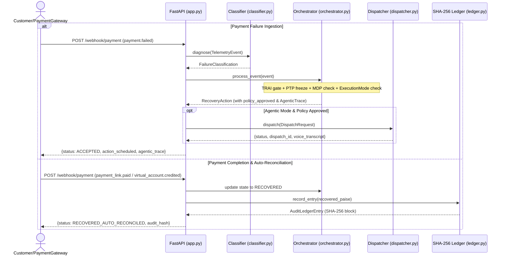

# Revive — Technical Specification & Architecture

This document describes the executable implementation of **Revive**.

## Core Invariant

> **AI/ML models classify and explain; deterministic policy rules, TRAI chrono-gates, stopping invariants, and mathematical MDP validate and execute.**

- Error code classification is an evidence-bound diagnostic, never an autonomous recovery verdict.
- Missing or ambiguous error signatures default to `TERMINAL_AUTH_REJECTED` (halt), not an inferred optimistic action.
- Recovery sequences are reproducible from stored facts: `entity_id`, `classification`, `attempt_count`, `gross_amount_paise`, bank CBS state, `scheduled_timestamp_epoch`.
- Every payment state transition is an audited, immutable SHA-256-hashed ledger block.

---

## Runtime Architecture & Layer Specs

| Layer | Technology | Responsibility |
| --- | --- | --- |
| **Presentation Layer** | Streamlit, Plus Jakarta Sans, JetBrains Mono | 5-tab command center: Theme & Automation Mode selector (`Agentic` vs `Manual`), KPI cards, CBS diagnostic inspector, MDP simulator, WhatsApp/Voice sandbox, SHA-256 ledger explorer. |
| **API Boundary** | FastAPI, Pydantic v2 | Endpoint routing (`/webhook/payment`, `/api/v1/ptp/commit`, `/api/v1/readiness`, `/api/event`, `/api/benchmark`), HMAC signature verification. |
| **Layer 1: Telemetry Diagnostic** | Python, CBS matrix dictionary | Diagnoses raw telemetry error signatures against issuing bank core banking system health matrix (HDFC, SBIN, ICIC, UTIB, KKBK). |
| **Layer 2: Policy & Agentic Orchestrator** | Python, MDP Bellman formulation | TRAI 08:00–19:00 IST chrono-gate (+12h shift), Promise-to-Pay (PTP) freeze epochs, MDP net yield stopping bounds, `MAX_ATTEMPTS = 3` caps, decision trace logging. |
| **Layer 3: Adaptive Multi-Channel Dispatcher** | Twilio SDK / Mock Mode | WhatsApp Hinglish messaging, TwiML Hinglish Voice IVR outbound call synthesis (`<Say language="hi-IN">`), 1-Click Payment Links (`/v1/payment_links`), Virtual Accounts (`/v1/virtual_accounts`). |
| **Layer 4: SHA-256 Audit Ledger** | Python `hashlib`, append-only chain | Cryptographic state-transition blocks (`f"{entity_id}:{status}:{recovered_paise}:{prev_hash}"`), paisa-exact settlement verification. |
| **Automated Orchestrator** | `run_demo.py`, `pyngrok` | Master process orchestrator launching FastAPI, Streamlit, and establishing public HTTPS webhook tunnel on port 8000. |

---

## Complete Request & Webhook Flow

---

## Intervention Channel Routing Matrix

| Attempt | Channel | Description | Delay | Cost (Paise) |
| --- | --- | --- | --- | --- |
| **Attempt 1 (Degradation)** | `SILENT_API_RETRY` | Silent API retry via `/v1/subscriptions/{id}/retry`. | +45m | 0 Paise |
| **Attempt 1 / 2 (Soft/Urgent)** | `WHATSAPP_HINGLISH` | Hinglish WhatsApp message with 1-click payment link or Virtual Account. | +15m / +24h | 60 Paise (₹0.60) |
| **Attempt 3 (Escalation)** | `VOICE_IVR_NUDGE` | Outbound Hinglish Voice IVR speech call via Twilio Voice TwiML (`<Say language="hi-IN">`). | +30m | 150 Paise (₹1.50) |
| **Attempt 4 / Exceeded** | `HUMAN_ESCALATION` | Escalates to manual finance operations queue. | Immediate | 500 Paise (₹5.00) |

---

## MDP Expected Net Yield & Stopping Formula

Calculates expected net return per attempt $k$:

$$\mathbb{E}[R_{\text{net}}](k) = P_{\text{success}}(k) \times \text{gross\_amount\_paise} - (C_{\text{channel}} + \lambda \cdot k)$$

Where:
- $P_{\text{success}}(k) = \max(0.05, 0.75 - (k-1) \cdot 0.25)$
- $C_{\text{channel}}$: Channel cost in Paise (`SILENT`: 0, `WHATSAPP`: 60, `VOICE`: 150, `HUMAN`: 500)
- $\lambda \cdot k$: Customer fatigue penalty ($100 \cdot k$ Paise)

**Halting Invariant**: If $\mathbb{E}[R_{\text{net}}](k) \le 0$, transition state to `HALTED_MDP_STOPPING_RULE` and halt further outreach.

---

## REST API Endpoint Reference

| Method | Path | Description |
| --- | --- | --- |
| `GET` | `/` | Root status, TRAI gate state, dispatcher mode |
| `GET` | `/api/health` | CBS matrix, active dispatches, ledger entry count |
| `GET` | `/api/v1/readiness` | Full engine readiness probe & cbs status |
| `POST` | `/webhook/payment` | Live payment webhook ingestion (failures & auto-reconciliation) |
| `POST` | `/api/event` | Process custom telemetry event (returns action + `agentic_trace`) |
| `POST` | `/api/dispatch` | Direct channel dispatch endpoint |
| `POST` | `/api/v1/ptp/commit` | Register Promise-to-Pay commitment date freeze |
| `GET` | `/api/benchmark` | Execute 50-record evaluation batch benchmark |
