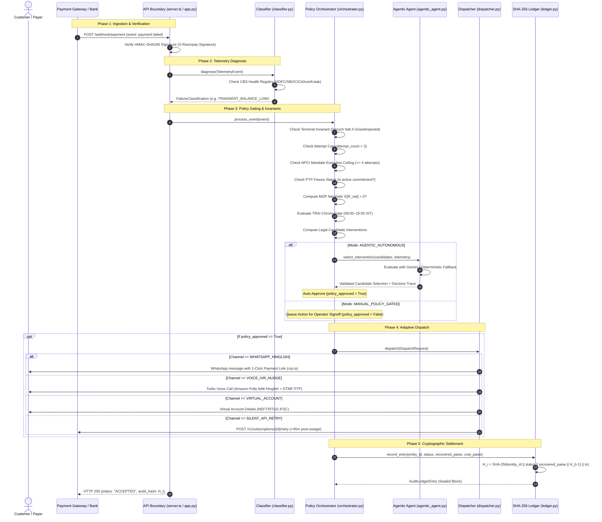

# Revive — Technical Architecture & Mathematical Specification

> **Deep Technical System Architecture, Sequence Flow & State Invariant Specifications**

[← Back to Master Overview](../README.md) • [Architectural Rules (AGENTS.md)](../AGENTS.md) • [System Readiness Probe](http://localhost:8000/api/v1/readiness)

---

## 1. Core Architectural Invariant

> **AI/ML models classify and explain; deterministic policy rules, TRAI chrono-gates, stopping invariants, and mathematical MDP validate and execute.**

- **Classification is Evidence-Bound**: Error code classification is an evidence-bound diagnostic mapping, never an unbounded recovery verdict.
- **Fail-Safe Default**: Missing or ambiguous telemetry signatures default to `TERMINAL_AUTH_REJECTED` (zero-touch halt), never an optimistic inferred retry.
- **Reproducibility**: Any past recovery action can be mathematically reproduced using recorded facts: `entity_id`, `raw_error_code`, `attempt_count`, `gross_amount_paise`, bank CBS state, and `scheduled_timestamp_epoch`.
- **Cryptographic Immutability**: Every payment state transition is an audited, tamper-evident SHA-256-hashed block in an append-only ledger.

---

## 2. Layered Architecture & Module Ownership

Revive enforces a strict 4-Layer Domain-Driven Design (DDD) separation with clear boundaries:

| Layer | Primary Components | Key Source Modules | Core Responsibility & Boundary |
| :--- | :--- | :--- | :--- |
| **Presentation** | React 18 + Tailwind / Streamlit | `src/components/`, `dashboard.py` | Command center UI: 5 canonical views (Overview, Console, Benchmark, Policy, Ledger). Triggers manual approvals, live simulations, and audit checks. **Cannot bypass invariants.** |
| **API & Bridge** | Express (Node.js) & FastAPI (Python) | `server.ts`, `app.py` | Webhook ingestion (`/webhook/payment`), HMAC-SHA256 signature verification, SSOT state queries, and bridge routing between runtime layers. |
| **Layer 1: Diagnostics** | `TelemetryClassifier`, CBS Registry | `src/classifier.py`, `src/engine/classifier.ts` | Maps error codes to failure classifications; parses Core Banking System (CBS) downtime matrix; uses bounded LLM for unstructured customer drop-off notes. |
| **Layer 2: Policy & MDP** | `ReviveOrchestrator`, `MDPYieldCalculator` | `src/orchestrator.py`, `src/engine/orchestrator.ts` | Evaluates TRAI chrono-gates (08:00–19:00 IST), PTP freezes, NPCI mandate ceilings, and finite-horizon MDP net yield stopping rule. Computes legal candidate actions. |
| **Layer 2.5: Agentic AI** | `AutonomousInterventionAgent` | `src/agentic_agent.py`, `src/engine/agenticAgent.ts` | Bounded LLM decision agent. Evaluates telemetry context and selects optimal intervention *strictly* from the pre-computed candidate set. Falls back to deterministic policy on error. |
| **Layer 3: Dispatcher** | `SentinelDispatcher`, Multi-Channel Handlers | `src/dispatcher.py`, `src/engine/dispatcher.ts` | Dispatches WhatsApp Hinglish messages, outbound Twilio Voice IVR speech calls with DTMF collection, 1-click Razorpay payment links, and Smart Collect Virtual Accounts. |
| **Layer 4: Ledger** | `AuditLedger` | `src/ledger.py`, `src/engine/ledger.ts` | Append-only SHA-256 hash chain recording every payment state mutation. Enforces integer Paise precision (zero IEEE-754 floating point errors). |

---

## 3. End-to-End Sequence & Webhook Flow



---

## 4. Payment Entity Lifecycle State Machine

Every recovery entity transitions through a strictly validated finite state machine:

```text
                     ┌──────────────────┐
                     │     PENDING      │
                     └────────┬─────────┘
                              │ Webhook Ingestion
                              ▼
                     ┌──────────────────┐
                     │    DIAGNOSED     │
                     └────────┬─────────┘
                              │
          ┌───────────────────┼───────────────────┐
          │                   │                   │
   Terminal Failure      E[R_net] <= 0      Legal Candidate
          │                   │                   │
          ▼                   ▼                   ▼
   ┌─────────────┐     ┌─────────────┐     ┌─────────────┐
   │   HALTED_   │     │   HALTED_   │     │  SCHEDULED  │
   │  TERMINAL   │     │     MDP     │     └──────┬──────┘
   └─────────────┘     └─────────────┘            │
                                                  │ Dispatch
                                                  ▼
                                           ┌─────────────┐
                                           │ DISPATCHED  │
                                           └──────┬──────┘
                                                  │
                        ┌─────────────────────────┴─────────────────────────┐
                        │ PTP Commitment                                    │ Payer Settles
                        ▼                                                   ▼
               ┌──────────────────┐                                ┌──────────────────┐
               │  PROMISE_TO_PAY  │                                │    RECOVERED     │
               │     PENDING      │                                │ (Auto-Reconciled)│
               └────────┬─────────┘                                └──────────────────┘
                        │
         ┌──────────────┴──────────────┐
         │ Paid                        │ Promise Expired
         ▼                             ▼
   ┌─────────────┐              ┌─────────────┐
   │  RECOVERED  │              │  ESCALATED  │
   └─────────────┘              └─────────────┘
```

---

## 5. Mathematical MDP Formulations & Stopping Invariants

Revive formalizes payment recovery as a **Finite-Horizon Markov Decision Process** over decision stages $k \in \{1, 2, 3\}$:

### 5.1 State Space $S$
$$s_k = (\text{EntityID}, \text{GrossAmount}, k, \text{BankStatus}, \text{ChannelHistory}, \text{PTPStatus})$$

### 5.2 Action Space $A(s)$
$$A(s) \subseteq \{\text{SILENT\_RETRY}, \text{WHATSAPP\_HINGLISH}, \text{VOICE\_IVR}, \text{VIRTUAL\_ACCOUNT}, \text{HALT}\}$$

### 5.3 Bellman Expected Net Yield Equation
For any candidate intervention action $a \in A(s)$ at attempt index $k$:

$$\mathbb{E}[R_{net}](s, a, k) = P(\text{success} \mid s, a, k) \cdot V_{\text{gross}} - \left( C_{\text{channel}}(a) + \lambda_{\text{fatigue}} \cdot k \right)$$

Where:
- $V_{\text{gross}}$: Transaction value in integer Paise ($1\text{ INR} = 100\text{ Paise}$).
- $P(\text{success} \mid s, a, k)$: Empirical recovery probability decayed by attempt index:
  $$P(k) = \max(0.05, 0.75 - (k-1) \cdot 0.25) \implies P(1) = 0.75, P(2) = 0.50, P(3) = 0.25$$
- $C_{\text{channel}}(a)$: Marginal transmission cost in Paise:
  - $\text{SILENT\_RETRY} = 0\text{ Paise}$
  - $\text{WHATSAPP\_HINGLISH} = 60\text{ Paise}$ (₹0.60)
  - $\text{VOICE\_IVR\_NUDGE} = 150\text{ Paise}$ (₹1.50)
  - $\text{HUMAN\_ESCALATION} = 500\text{ Paise}$ (₹5.00)
- $\lambda_{\text{fatigue}} \cdot k$: Customer fatigue penalty function ($\lambda = 100\text{ Paise/attempt}$).

### 5.4 Stopping Invariant Rule
The recovery sequence strictly transitions to `HALTED_MDP_STOPPING_RULE` if:
$$\max_{a \in A(s)} \mathbb{E}[R_{net}](s, a, k) \le 0$$
No candidate is dispatched if its net expectation is non-positive. This guarantees that Revive will **never incur communication debt on micro-transactions or deeply decayed debt**.

---

## 6. Regulatory & Chronological Compliance Engine

### 6.1 TRAI Chrono-Gate (TCCCPR 2018)
- **Customer Outreach Window**: 08:00 AM to 07:00 PM IST (02:30 to 13:30 UTC).
- **Time Calculation**: Evaluated using timezone-independent epoch math:
  $$\text{ist\_hour} = \left( \lfloor t_{\text{epoch}} + 19800 \rfloor \pmod{86400} \right) \div 3600$$
- **Deferral Logic**: Any non-compliant customer-facing message is deferred by `+12h` ($43,200\text{ seconds}$), with `is_trai_deferred = True`.
- **Exemptions**: Machine-to-machine silent API retries are exempt and run 24/7.

### 6.2 NPCI AutoPay Mandate Execution Ceiling
Under NPCI Circular rules for AutoPay and e-Mandates, a debit instruction cannot be re-presented indefinitely:
- **Maximum Execution Attempts**: 4 attempts total (1 initial + 3 retries).
- **Outage Pacing**: Retries must be spaced outside the issuing bank's known CBS downtime window (+45 minutes).
- **Separate Ceilings**: The mandate execution ceiling (governing bank account debit requests) is decoupled from the customer contact attempt cap (governing WhatsApp and Voice messages).

---

## 7. Cryptographic SHA-256 Audit Ledger Specification

Every state mutation in the recovery lifecycle appends a verified block to the immutable chain:

### 7.1 Block Hash Schema
$$H_i = \text{SHA-256}\left( \text{log\_id} \parallel \text{entity\_id} \parallel \text{status} \parallel \text{recovered\_paise} \parallel H_{i-1} \parallel \text{timestamp} \right)$$

### 7.2 Genesis Block
For $i = 0$:
$$H_0 = \text{SHA-256}("0" \parallel \text{"GENESIS"} \parallel \text{"GENESIS\_CHAIN"} \parallel 0 \parallel "0" \times 64 \parallel \text{genesis\_ts})$$

### 7.3 Cryptographic Proof Verification Algorithms
1. **$O(1)$ Single-Block Proof Verification**: Given `log_id`, retrieves block $B_i$ and parent $B_{i-1}$, recomputes the expected hash using stored canonical attributes, and validates that $H_i == H_{\text{recomputed}}$.
2. **$O(N)$ Chain Integrity Verification**: Iterates from block $1$ to $N$, ensuring that for every block $i$, $B_i.\text{prev\_hash} == B_{i-1}.\text{audit\_hash}$ and $B_i.\text{audit\_hash} == \text{SHA-256}(\text{data}_i)$. Any mutation in past events produces a cryptographic cascade that immediately flags the chain as corrupted.

---

## 8. REST API Specification

All endpoints support JSON request/response bodies and integer Paise currency fields:

| Method | Endpoint | Description | Auth / Security |
| :--- | :--- | :--- | :--- |
| `GET` | `/api/v1/readiness` | System health, CBS registry status, and ledger length | None |
| `GET` | `/api/health` | Diagnostic CBS matrix & engine connection status | None |
| `POST` | `/webhook/payment` | Ingests live payment failure & settlement webhooks | `X-Razorpay-Signature` HMAC |
| `POST` | `/api/v1/webhook/razorpay` | Razorpay-specific webhook listener with auto-reconciler | `X-Razorpay-Signature` HMAC |
| `GET` | `/api/v1/entity/{id}/ssot` | Unified Single Source of Truth inspector for an entity | None |
| `POST` | `/api/event` | Evaluates a custom telemetry event and returns action | None |
| `POST` | `/api/v1/ptp/commit` | Registers a Promise-to-Pay commitment date freeze | None |
| `POST` | `/api/v1/operator/approve` | Human-in-the-loop operator approval for manual queue | None |
| `POST` | `/api/v1/operator/reject` | Human-in-the-loop operator rejection and permanent halt | None |
| `GET` | `/api/v1/ledger/audit/{id}` | Single-block cryptographic SHA-256 proof validator | None |
| `GET` | `/api/benchmark` | Runs 50-record evaluation benchmark batch | None |
| `POST` | `/api/dispatch` | Dispatches recovery action to WhatsApp or Voice IVR | None |
